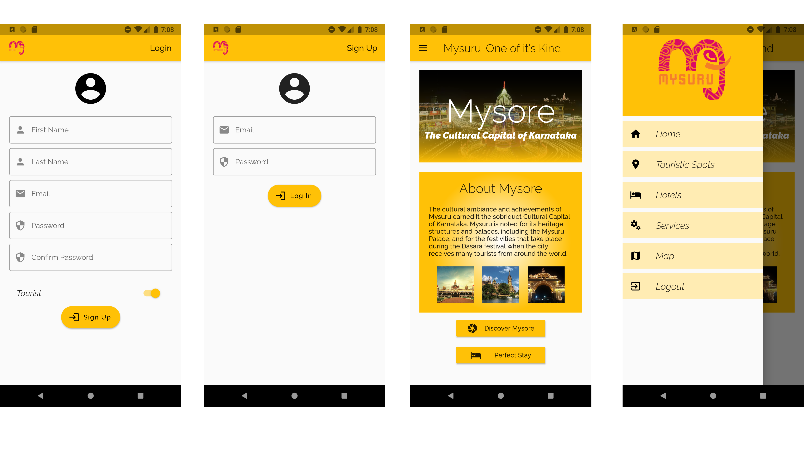
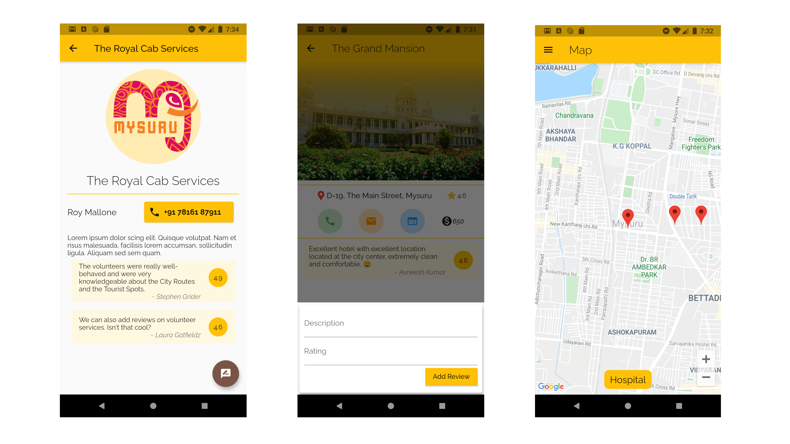
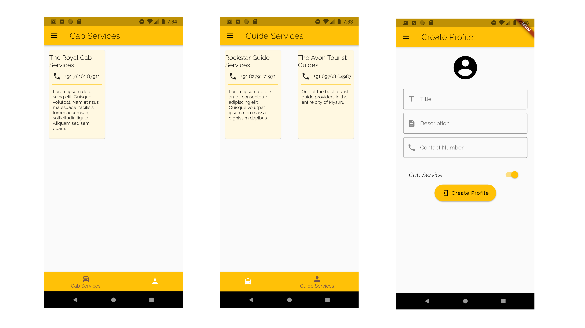

# Mysuru-Tourism-App
Welcome Guys! This repo consists of the code for the Mysuru Tourism App made using Flutter, which me, <a href="https://github.com/Pranshu-Tripathi" target="_blank">Pranshu</a>, and <a href="https://github.com/Cybertron-Avneesh/Cybertron-Avneesh" target="_blank">Avneesh</a> made as a part of Code-Off Duty Hackathon, conducted by <a href="https://dscwow.tech/" target="_blank">DSC WoW</a>.  
You can see the Live Demo of the app on <a href="https://youtu.be/Bf8gMTH5Ck8" target="_blank">Youtube</a>. Also, I have attached some screenshots of the Application as a Reference. Make sure to leave us some Feedback.  

# Our Vision for the App
- In the Hackathon, we were provided with the track to help the Post Covid Tourism, and our track included to specifically deal and help, tackle down the effects of Covid-19, on the tourism industry in Mysuru. 
- So we came up with this app, that enlists all the Places and Hotels in Mysuru, which the User can browse through. 
- Not just that, a User can also add Reviews on each Hotel & Place.  
- Apart from that, it also acts as a platform to connect Volunteers & Tourists, wherein, the Volunteers can register themselves & create their profiles, and the Users can find the information for any specific Volunteer. 
- Also, a User can give reviews to each and every specific Volunteer.  
- Added to that, we have also provided a Map of Mysuru for the tourists, where we have added the markers of emergency services, like Hospitals, Police Stations, etc.  

# Screenshots

  
We'll be waiting for your precious feedback.  
Happy Coding :)

